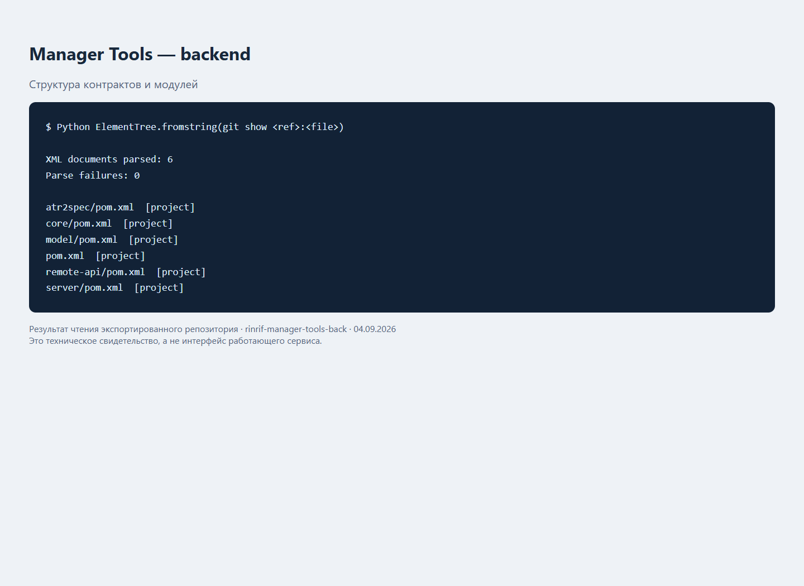
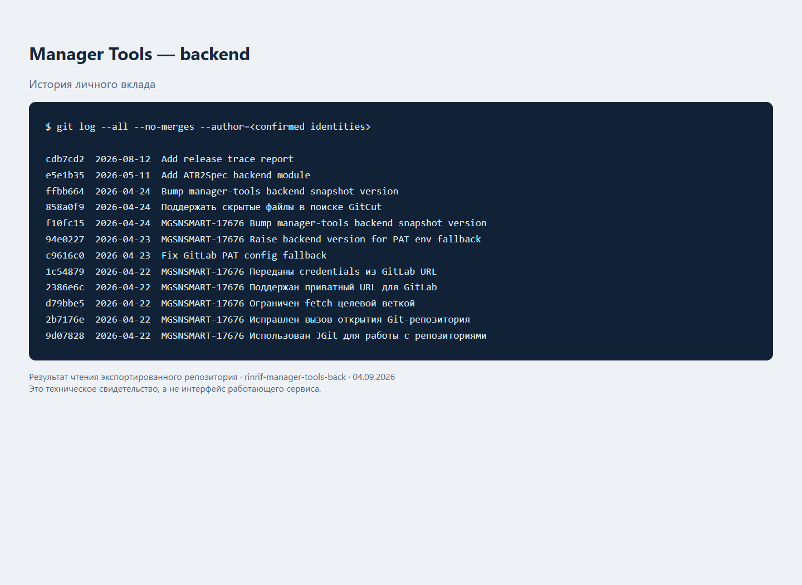

# Manager Tools — backend

Java backend служебных инструментов GitCut и ATR2Spec.

Приватный архив и описание работы Сергея Комарова. [Общий каталог](https://github.com/komaroffsergei/rinrif-portfolio).

## Назначение

- Поиск изменений в GitLab
- Подготовка черновика постановки из АТР
- API, модели и отчёты трассировки релизов

## Технологии

Java, Maven.

## Мой вклад

В истории подтверждены следующие изменения под моими Git-идентичностями:

- Add ATR2Spec backend module. [Изменение](https://github.com/komaroffsergei/rinrif-manager-tools-back/commit/e5e1b35b60261bb21fb1c72ca8fa01a0504ea75c).
- Поддержать скрытые файлы в поиске GitCut. [Изменение](https://github.com/komaroffsergei/rinrif-manager-tools-back/commit/858a0f9345eec0e865ce99f4af4f0543e2ee5422).
- Raise backend version for PAT env fallback. [Изменение](https://github.com/komaroffsergei/rinrif-manager-tools-back/commit/94e0227e19afd1df8318128b1d9f41c54602fa10).
- Fix GitLab PAT config fallback. [Изменение](https://github.com/komaroffsergei/rinrif-manager-tools-back/commit/c9616c0f758e9620dc9f66e96b60f66ab9c49c42).
- Переданы credentials из GitLab URL. [Изменение](https://github.com/komaroffsergei/rinrif-manager-tools-back/commit/1c5487977c74dc2ee7987244a680ddc4c1ce3b26).
- Поддержан приватный URL для GitLab. [Изменение](https://github.com/komaroffsergei/rinrif-manager-tools-back/commit/2386e6cb65f66ba1867d5de86ef9d423fbec74c7).
- Ограничен fetch целевой веткой. [Изменение](https://github.com/komaroffsergei/rinrif-manager-tools-back/commit/d79bbe57d1d82eb0542d9bd42590c3122cd08db0).
- Исправлен вызов открытия Git-репозитория. [Изменение](https://github.com/komaroffsergei/rinrif-manager-tools-back/commit/2b7176e44f7defa1dc48fc4ac8c9ce611596dc34).

Учтено **17 коммитов без merge** во всех сохранённых ветках. Cherry-pick одного изменения может иметь несколько хешей; число коммитов не равно числу задач. Авторство сопоставлено с `skomarov@reinform.ru` и `init.reg@gmail.com` по подтверждению владельца. Архивные снимки и подготовка этого README в статистику разработки не включены.

[Подробности и ссылки на коммиты](docs/portfolio/contribution.md) · [Архитектура и запуск](docs/portfolio/project.md) · [История переноса](docs/portfolio/history.md)

## Скриншоты

[Источник, версия и ограничения снимков](docs/portfolio/verification.md).

[Исходная документация проекта](docs/portfolio/original-readme.md) сохранена отдельно.
